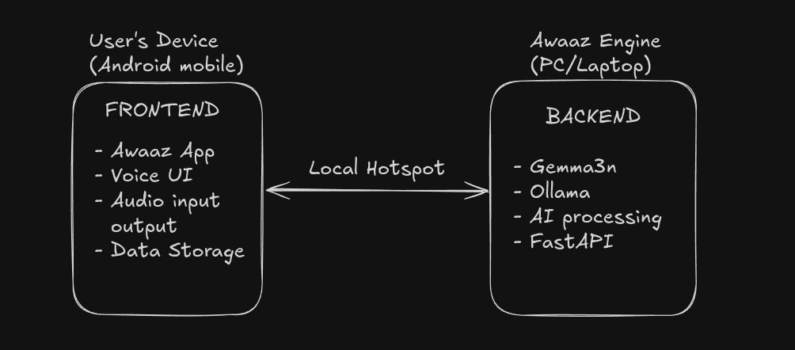

# Awaaz - Voice Assistant for Blind Users

**Awaaz is a fully offline, voice-first AI health companion built for blind and visually impaired users.**
**Unlike mainstream assistants, Awaaz works entirely without the internet, delivering privacy, independence, and critical health reminders-even in rural and low-connectivity areas.**
**Built for the Gemma 3n Hackathon, my mission is simple: Empower users too often ignored by big tech.**

---

## 🎬 Demo Video

[▶️ Watch the Demo](DEMO_LINK)

*To fully experience Awaaz, use an Android device + a secondary device (PC or Android phone) as described below.*

---

## Judging Criteria Highlights

* **Impact & Vision:**
  Offline AI health support for blind users; privacy-first, built for real-world needs.

* **Video Pitch & Storytelling:**
  Engaging demo focused on accessibility and user experience.

* **Technical Depth & Execution:**
  Fully functional offline AI using Gemma 3n and Ollama; robust, accessible engineering.

---

## Screenshots

> *(Include 1–2 screenshots of the main app UI, the medication reminder flow, or your architecture diagram here. Use alt-text for accessibility. If you don’t have time, you can skip this section.)*

---

## Project Overview

**Awaaz** is a two-device, peer-to-peer voice assistant system that empowers blind users to manage their health through natural conversation.
It provides medicine reminders with empathetic dialogue-powered entirely offline using Google’s Gemma 3n model.

---

### How It Works

* **Primary Device:** Android phone (the blind user's device) running the Awaaz app.
* **Secondary Device:** PC (or any Linux/Mac/Windows computer) running the "Awaaz Engine" backend (Ollama with Gemma 3n).\
*(Edge devices like NVIDIA Jetson are planned for future releases.)*
* **Connection:** Local Wi-Fi hotspot - **No Internet Required**.

---

## Why Awaaz Stands Out

* **True Offline Voice AI:** All processing happens locally-no user data ever leaves their hands.
* **Privacy by Design:** No cloud processing, no third-party data sharing, ever.
* **Real Accessibility:** Designed based on interviews with blind students-fully audio, screen reader compatible, feedback on all actions.

---

## Key Features

* **Voice Commands:** Natural language processing with cancel/clear support.
* **Audio Feedback:** Text-to-speech responses and audio cues for every action.
* **Medicine Reminders:** Notification system for scheduled medication times.
* **Hotspot Connection:** Direct, peer-to-peer app-to-engine link (no router needed).
* **Recording Validation:** Smart feedback for very short or failed voice recordings.
* **Accessibility First:** Designed for simple, voice-first interaction and minimal visual clutter.

---

## Prerequisites

### Backend (Secondary Device: PC/Laptop)

* Python 3.8+
* FastAPI
* Uvicorn
* Ollama (with Gemma 3n model)
* Required Python packages (`requirements.txt`)

### Frontend (Primary Device: Android Phone)

* Node.js 16+
* Expo CLI
* React Native development environment
* Android device or emulator
* Expo Go app (for local testing)

---

## Installation & Setup

### Backend Setup (Secondary Device)

1. **Clone the Repository**

   ```bash
   git clone https://github.com/abhishekblue/gemma3n-hackathon.git
   cd gemma3n-hackathon
   ```
2. **Create Virtual Environment**

   ```bash
   python -m venv venv
   source venv/bin/activate  # On Windows: venv\Scripts\activate
   ```
3. **Install Python Dependencies**

   ```bash
   pip install -r requirements.txt
   ```
4. **Install Ollama & Gemma 3n**

   ```bash
   # Install Ollama
   curl -fsSL https://ollama.ai/install.sh | sh

   # Pull Gemma 3n model
   ollama pull gemma3n:e2b-it-q4_K_M
   ```
5. **Setup STT and TTS Models**

   - **Speech-to-Text (STT):**  
     Download and place the [Vosk](https://alphacephei.com/vosk/) model `vosk-model-en-us-0.22-lgraph` in the `stt-model/` directory.

   - **Text-to-Speech (TTS):**  
     Download and place the [Piper](https://github.com/rhasspy/piper) model `en_US-hfc_female-medium.onnx.json` in the `tts-model/` directory.

   - *(See the Vosk and Piper documentation for more on downloading and setting up these models.)*

6. **Start the Backend**

   ```bash
   uvicorn main:app --host 0.0.0.0 --port 8000
   ```
---

### Frontend Setup (Primary Device: Android)

1. **Navigate to the App Directory**

   ```bash
   cd awaaz-app
   ```
2. **Install Dependencies**

   ```bash
   npm install
   ```
3. **Install Expo CLI Globally (if not already installed)**

   ```bash
   npm install -g @expo/cli
   ```
4. **Start Development Server (optional)**

   ```bash
   npx expo start
   ```
5. **Production Build:**

   * Build Android APK (`eas build -p android`) or use Expo Go for quick testing.

---

### Network Connection Setup

1. **Create Hotspot:** Enable hotspot on the secondary device or use a shared local network.
2. **Connect Primary Device:** Connect your Android phone to the hotspot or local network.
3. **Configure IP:** Enter the backend device's IP in the Awaaz app settings.
4. **Test Connection:** Ensure backend and app can communicate (see Troubleshooting below).

---

### Permissions Setup

The mobile app requests:

* **Microphone Access:** Voice commands
* **Notification Permission:** Medicine reminders & alerts

*If permissions are blocked, enable them manually in Android Settings → Apps → Awaaz-app → Permissions.*

---

## Usage Instructions

1. **Start the Backend** on the secondary device.
2. **Connect Both Devices** to the same hotspot or local network.
3. **Set Backend IP in Code:**  
   The backend IP address is hardcoded in the app’s source code.  
   Before building the APK, update the IP address wherever it appears in the code.
4. **Build and Install:**  
   Rebuild the APK using `eas build` and install it on your Android device.
5. **Use Voice Commands:** Tap the mic button and speak naturally.
6. **Experience Audio Feedback** for all actions.

> *Note: In this MVP, the backend IP is hardcoded in the app source code. A user-editable option is planned for future versions.*


**Command Controls:**

* Say “cancel” or “clear” to interrupt any operation.
* Very short voice recordings trigger an instant audio prompt.

---

## Technical Architecture



---

## Project Structure

```

gemma3n-hackathon/
├── backend/                # FastAPI backend (Ollama/Gemma 3n integration)
│   ├── main.py
│   ├── stt-model/
│   ├── tts-model/
│   └── requirements.txt
├── awaaz-app/              # React Native frontend (Android)
│   ├── app/                # Main navigation and screens
│   │   ├── (tabs)/
│   │   ├── assets/
│   │   ├── components/
│   │   │   └── ui/
│   │   ├── utils/
│   │   └── ...
│   ├── app.json
│   ├── eas.json
│   ├── package.json
│   └── ...
└── README.md

```

---

## Audio Assets

Audio cues for every interaction:

- **ding.mp3** - Recording start sound
- **ending.mp3** - Converstaion finished sound
- **processing.mp3** - Processing feedback sound

---

## Offline Operation

* 100% offline-perfect for privacy and rural users.
* All AI processing on local hardware (via Ollama + Gemma 3n).
* STT & TTS models run locally.
* All user data stays on device.

---

## Final Product

* **Primary Device:** Android app (can be tested via Expo on PC)
* **Secondary Device:** PC or Android phone with Ollama/Gemma 3n backend
* **Connection:** Local hotspot network
* **Deployment:** Mobile APK + backend setup

---

## Future Vision / Roadmap

Awaaz is not just a hackathon project-here’s how it can grow:

* **Prescription Image Recognition** (phone camera integration)
* **Integration with Government Health DBs** (for verified medication data)
* **Multi-lingual Support** (Hindi, Tamil, and more)
* **NVIDIA Jetson/Edge Device Support** (super-portable, low-power deployment)
* **Community Feedback Loop:** Continuous improvement from real blind users and NGOs

---

## Troubleshooting

**Common Issues**

- **Connection Failed:** Check both devices are on the same network.
- **IP Address Issues:** The backend device’s IP address may change if it’s assigned dynamically. Always double-check and update the hardcoded IP before building the APK.
- **Firewall Blocking Connection:** Ensure your PC firewall (e.g., Windows Defender) or any antivirus is not blocking port 8000 or local network traffic.
- **Audio Not Playing:** Check phone volume, permissions, or Android settings.
- **Backend Not Starting:** Ensure port 8000 is free; run as admin if needed.
- **Ollama Issues:** Confirm Gemma 3n model is downloaded and running (via `ollama serve`).
- **Model Loading Issues:** Make sure STT/TTS models are present in the right folders.

**Debug Commands**

```bash
# Check backend status
curl http://YOUR_IP:8000/

# Check Ollama status
ollama list

# Backend logs
uvicorn main:app --host 0.0.0.0 --port 8000 --log-level debug

# Mobile app logs (Expo)
expo start --clear
```

---

## Contributing

This is a hackathon project, but contributions for accessibility improvements are welcome!

---

## License

[MIT License](LICENSE) - Feel free to use this project to help the visually impaired community.

---

## Contact

**Developer:** Abhishek Jain
**Email:** [jainabhishekjain007@gmail.com](mailto:jainabhishekjain007@gmail.com)
**GitHub:** [https://github.com/abhishekblue](https://github.com/abhishekblue)

---

**Made with care for accessibility and inclusion.**
*Empowering blind users through voice technology.*

**Hackathon Submission:** Google - The Gemma 3n Impact Challenge
**Repository:** [https://github.com/abhishekblue/gemma3n-hackathon](https://github.com/abhishekblue/gemma3n-hackathon)

---